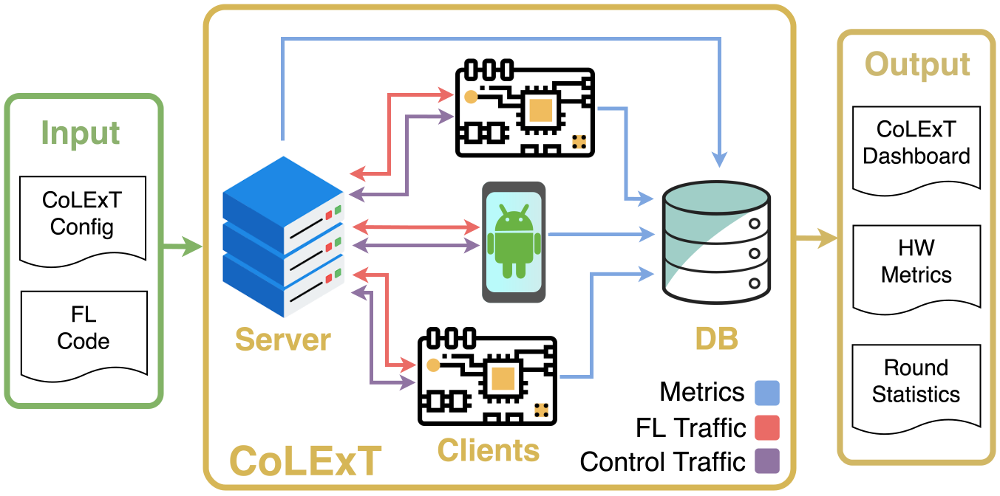
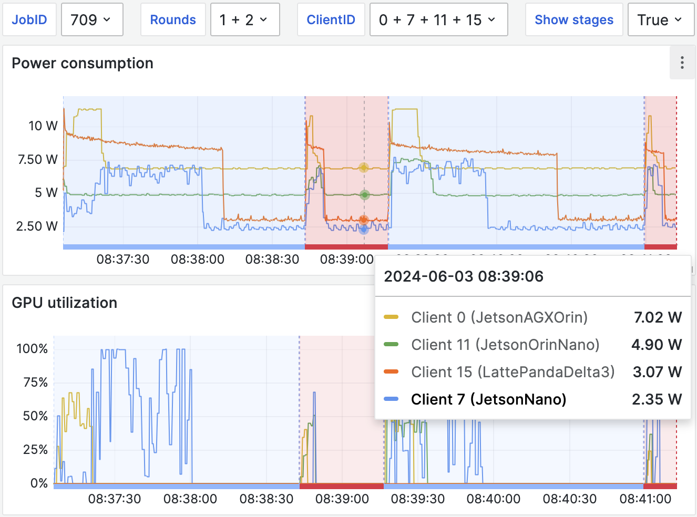

# CoLExT: Collaborative Learning Experimentation Testbed
CoLExT is a testbed built for machine learning researchers to realistically execute and profile Federated Learning (FL) algorithms on real edge devices and smartphones.
This repo contains the software library developed to seamlessly deploy and monitor FL experiments compatible with the [Flower](https://github.com/adap/flower) Framework.
Consider checking the [CoLExT website](https://sands.kaust.edu.sa/project/colext/) for an overview of the project.

CoLExT contains 20 smartphones and 28 Single Board Computers (SBC) and is hosted at the King Abdullah University of Science and Technology (KAUST).
If you’d like to experiment with CoLExT, please show your interest by filling out this [form](https://forms.gle/tpJJ1ehV3Zs1oCUv9).

> [!WARNING]
> CoLExT supports both SBC and Android deployments; however, Android deployment is not yet available in this branch.

<p align="center">
  
</p>

# Using CoLExT
**Note**: Requires prior approval. Please fill out the show of interest [form](https://forms.gle/tpJJ1ehV3Zs1oCUv9) if you're interested.
1. Access the CoLExT server. How to [access CoLExT](#accessing-the-colext-server).
1. Install the CoLExT package in a local Python environment, e.g., with conda.
    ```bash
    conda create -n colext_env python=3.10 && conda activate colext_env

    # The plotting extras automatically generate metric plots
    (colext_env)$ pip install colext[plotting] git+https://git@github.com/sands-lab/colext.git
    ```
1. In the FL code, import the `colext` decorators and wrap Flower's client and strategy classes.
   Note: If used outside of the testbed, these decorators do not modify the program behavior and thus can safely be included in the code in general.
    ```Python
    from colext import MonitorFlwrClient, MonitorFlwrStrategy

    @MonitorFlwrClient
    class FlowerClient(fl.client.NumPyClient):
      [...]
    @MonitorFlwrStrategy
    class FlowerStrategy(flwr.server.strategy.Strategy):
      [...]
    ```
1. Create a CoLExT configuration file `colext_config.yaml`. CoLExT exposes bash environment variables with information about the experiment.
   Please remember to pass the FL server address to the clients. Here's an example configuration file using SBC devices:
    ```YAML
    # colext_config.yaml
    project: colext_example

    code:
      # path: <code-root-dir>
      # if `path` is ommited it defaults to config file dir
      client:
        # Assumes relative paths from path
        command: >-
          python3 ./src/client.py
          --client_id=${COLEXT_CLIENT_ID}
          --server_addr=${COLEXT_SERVER_ADDRESS}
      server:
        command: >-
          python3 ./src/server.py
          --n_clients=${COLEXT_N_CLIENTS}
          --n_rounds=3

    clients:
      - dev_type: LattePandaDelta3
        count: 6

      - dev_type: JetsonOrinNano
        count: 4

      - dev_type: OrangePi5B
        # If `count` is not specified, it's assumed to be 1

      - dev_type: OrangePi5B
        count: 2
        # Add additional arguments only to this client group
        add_args: "--steps=200"


    monitoring:
      scraping_interval: 0.3  # Freq. of data collection (seconds)
      push_to_db_interval: 10 # Freq. for database updates (seconds)
    ```

1. Specify your Python dependencies using a `requirements.txt` file in the same directory as the CoLExT configuration file.
1. Deploy, monitor the experiment in real-time, and download the collected performance metrics as CSV files.

    ```bash
    # Execute in the directory with the colext_config.yaml
    $ colext_launch_job
    # Prints a job-id and a dashboard link

    # After the job finishes, retrieve metrics for job-id as CSV files
    $ colext_get_metrics --job_id <job-id>
    ```

    Dashboard example:
    <p align="center">
      
    </p>

1. To confirm the deployment is working, try launching an example:
    ```bash
      $ cd colext/examples/flwr_tutorial
      $ colext_launch_job
    ```

Continue reading for more information on the above steps and check the tips section for the deployment type you're interested in:
- [SBC deployment](#tips-for-sbc-deployment)
- [Android deployment](#tips-for-android-deployment) (Not yet in this repo)

# CoLExT configuration file (colext_config.yaml)
This section describes the possible configuration options for the CoLExT configuration file.

### Currently available devices
```YAML
# SBCs
  - { dev_type: JetsonAGXOrin,  count: 2 }
  - { dev_type: JetsonOrinNano, count: 4 }
  - { dev_type: JetsonXavierNX, count: 2 }
  - { dev_type: JetsonNano, count: 6 }
  - { dev_type: LattePandaDelta3, count: 6 }
  - { dev_type: OrangePi5B, count: 8 }
# !!! Currently, this config file will not work with smartphones !!!
# Smartphones
  - { dev_type: SamsungXCover6Pro, count: 3 }
  - { dev_type: SamsungGalaxyM54, count: 2 }
  - { dev_type: Xiaomi12, count: 2 }
  - { dev_type: XiaomiPocoX5Pro, count: 2 }
  - { dev_type: GooglePixel7, count: 5 }
  - { dev_type: AsusRogPhone6, count: 2 }
  - { dev_type: OnePlusNord2T5G, count: 2 }
```

Occasionally, device maintenance is required, rendering them unavailable for experiments. To check the current availability of each device type, use the command below:

```bash
$ colext_get_dev_count
      1 colext (FL Server)
      2 jao    (Jetson AGX Orin)
      6 jn     (Jetson Nano)
      4 jon    (Jetson Orin Nano)
      2 jxn    (Jetson Xavier NX)
      4 lp     (LattePanda Delta 3)
      8 op     (OrangePi 5B)
```

### Exposed environment variables
CoLExT exposes several bash environment variables that are passed to the execution environment. These can be used as arguments in the `args` section of the client and server code by expanding the variables as `${ENV_VAR}`. See the [usage example](#using-colext) for an example.

| Name                    | Description                       |
| ----------------------- | --------------------------------- |
| COLEXT_CLIENT_ID        | ID of the client (0..n_clients)   |
| COLEXT_N_CLIENTS        | Number of clients in experiment   |
| COLEXT_DEVICE_TYPE      | Hardware type of the client       |
| COLEXT_SERVER_ADDRESS   | Server address (host:port)        |
| COLEXT_DATASETS         | FL datasets naturally partitioned |
| COLEXT_PYTORCH_DATASETS | Pytorch datasets caching path     |
| COLEXT_JOB_ID           | Experiment job ID                 |


### Performance monitoring options
```YAML
monitoring:
  live_metrics: True # True/False: True if metrics are pushed in real-time
  push_interval: 10 # in seconds: Metric buffer time before pushing metrics to the DB
  scraping_interval: 0.3 # in seconds: Interval between metric scraping
```

### Python version and deployers
Deployers:
- sbc (default) - Deployer for SBC experiments. It's the default deployer.
- local_py - Deployer that launches a local experiment. Clients and the server are launched in the CoLExT server.
- android (pending merge) - This deployer has been developed but needs to be merged here.

Python versions: 3.10 (default) | 3.8.
```
deployer: local_py
code:
  python_version: "3.8"
```

# Collected metrics
After calling `colext_get_metrics --job_id <job-id>`, csv files prepended with `colext_<job_id>_` are downloaded to the current directory.
Here are the contents for each CSV:

### client_round_timings.csv
- round_number: Number of the FL round
- stage: Stage of the round: FIT or EVAL
- start_time: Start of the round as measured by the FL server
- end_time: End of the round as measured by the FL server
- srv_accuracy: Flwr strategy evaluate result with dict key "accuracy"
- dist_accuracy: Flwr strategy aggregate_evaluate result with dict key "accuracy"

### client_info.csv
- client_id: ID of the client
- dev_type: Device type as requested in the config file
- device_name: Name of the device with the associated device type

### client_round_timings.csv
- client_id: ID of the client
- round_number: Number of the FL round
- stage: Stage of the round: FIT or EVAL
- start_time: Start of the round as measured by the client
- end_time: End of the round as measured by the client

### hw_metrics.csv:
- client_id: ID of the client
- time: Local timestamp when the metrics were collected
- cpu_util: CPU Utilization (%) - Percentage over 100%, indicates multiple cores being used
- gpu_util: GPU Utilization (%)
- mem_util: Memory Utilization (Bytes) - The memory reported is the [RSS memory](https://en.wikipedia.org/wiki/Resident_set_size).
- n_bytes_sent: Number of bytes sent (Bytes)
- n_bytes_rcvd: Number of bytes received (Bytes)
- net_usage_out: Upload bandwidth usage (Bytes/s)
- net_usage_in: Download bandwidth usage (Bytes/s)
- power_consumption: Power consumption (Watts) - Reported power differs between devices
  - Nvidia Jetsons: Entire board power consumption
  - LattePandas: CPU power consumption
  - OrangePis: Can be measured using High Voltage Power Meter

### Summary data
Coming soon...

# Tips for SBC deployment
The SBC deployment containerizes user code and deploys it using Kubernetes.
Before starting the deployment process, it's recommended to make sure that a local deployment is working as expected.
Local deployment can be used by changing the deployer to `local_py`. More information on setting the deployer [here](#python-version-and-deployers).

Once this is verified, check the containerization is working as expected by running the `colext_launch_job` command in the "prepare" mode.
This mode will perform checks and containerize the application, ensuring all the dependencies can be installed in the container.
```Bash
# Prepares app for deployment
$ colext_launch_job -p
```

### Excluding files from CoLExT containerization
Files can be excluded from the automatic containerization by using a `.dockerignore` file on the same directory as the `colext_config.yaml`. For details on `.dockerignore`, check the [docker documentation](https://docs.docker.com/reference/dockerfile/#dockerignore-file).

### Debugging
Once the code is successfully deployed to CoLExT, it can be useful to debug issues using the Kubernetes CLI. In our deployment, we're using Microk8s with an alias to kubectl we called `mk`. Here are the most useful commands:
```Bash
# See current pods deployed in the cluster
$ mk get pods -o wide
# See and (f)ollow the logs of a specific pod
$ mk logs <pod_name> -f
# Read logs of a failed pod
$ mk logs <pod_name> -p
```

### Porting Poetry projects
Currently, CoLExT does not work with dependencies specified by Poetry. These can easily be converted to the supported requirements.txt format with these commands:
```
# Prevents Poetry resolver from being stuck waiting for a keyring that we don't need
export PYTHON_KEYRING_BACKEND=keyring.backends.null.Keyring
poetry export --without-hashes -f requirements.txt --output requirements.txt
```

# Tips for Android deployment
Coming soon...

# Accessing the CoLExT server
Currently, the CoLExT server is not reachable through a public IP.
To enable access to the server, we're using [ZeroTier](https://www.zerotier.com/) to create a virtual private network.
This allows external users to interact with the server as if they were directly on the same private network.

### Connect to CoLExT server:
1. [Install ZeroTier](https://www.zerotier.com/download/).
1. Get your ZeroTier device ID. The ID is displayed at installation and can be retrieved later with:
    ```
    sudo zerotier-cli info | awk '{print $3}'
    ```
1. Share your ZeroTier device ID and a public SSH key with your CoLExT contact point
1. Add an SSH config. Note that you need to replace the username:
    ```
    # Add to ~/.ssh/config
    Host colext
        User <your_username>
        Hostname 10.244.96.246
        ForwardAgent yes # Required to use local SSH keys in CoLExT
    ```
1. Add the CoLExT server to your hosts file.
    ```
    # Add to /etc/hosts
    10.244.96.246 colext
    ```
1. Wait for your device to be added to the ZeroTier network
1. Test connection to CoLExT server:
    ```bash
    # Confirm connectivity
    $ ping colext
    # Confirm ssh access
    $ ssh colext
    ```

At this point, if you're just getting started, continue reading the next step in the [using colext section](#using-colext).
If you find issues connecting to CoLExT, reach out to your CoLExT concact point.

# Developing the CoLExT package
Install the CoLExT package locally with the --editable flag.
```bash
$ python3 -m pip install -e <root_dir>
```
Useful:
- Experiment with launching an example using the local deployer
  ```YAML
  # colext_config.yaml
  deployer: local_py
  ```
- Prepare the deployment only by launching the job with the prepare flag:
  ```Bash
  $ colext_launch -p
  ```

### Repo overview
```
.
├── src/colext/     # Python package used to deploy user code and interact with results
│   ├── scripts/    # Folder with CoLExT CLI commands: launch_job + get_metrics
├── examples/       # Example of Flower code integrations with CoLExT
├── plotting/       # Ploting related code
├── colext_setup/   # CoLExT setup automation
│   ├── ansible/            # Ansible playbooks that perform the initial configuration of SBC devices
│   ├── db_setup/           # DB schema and initial DB populate file
│   ├── base_docker_imgs/   # Base docker images used when containerizing the code
```

# Limitations:
- Currently, CoLExT only supports FL code using the Flower framework 1.5-1.9.
- `tensorflow` package does not work with LattePandas.
  Tensorflow builds from PiPy for x86 arch expect the CPUs to have support for AVX instructions, but the LattePanda's CPUs do not have them.
- Currently, Nvidia Jetsons defaults to supporting Pytorch 2.2.0. Except for Jetson Nanos, which only support up to Pytorch 1.13.
  Additional Pytorch versions can be supported upon request.
- Currently, only Python version 3.8 and 3.10 are supported.
